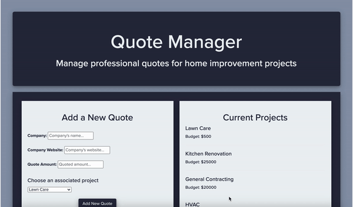

# Quote Manager

* [Quote Manager Demo](https://vimeo.com/497047241)

Quote Manager is a web application used to organize professional quotes obtained for one's home improvement projects. The application is divided into two separate GitHub repositories. While this one is for the frontend, the backend can be found here:  git@github.com:ejgann/quote_manager_backend.git

## Features

- A dashboard on which to view all active quotes
- A form through which to add newly acquired quotes
- A list of all current household projects plus their respective budgets

## Project Status

This project is a student project for Flatiron School software engineering curriculum. The author hopes to add onto and continue to build this application in the future.
